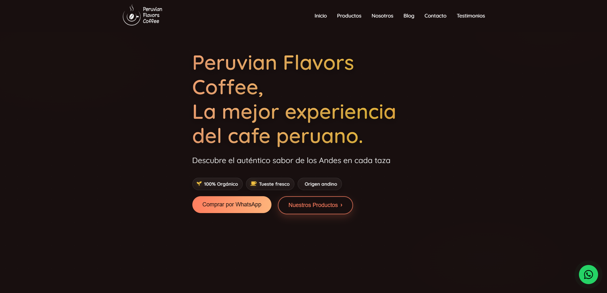

# ☕ Peruvian Flavors Coffee 🇵🇪


> **El sabor del café peruano, directo a tu taza**  
> Página web oficial de *Peruvian Flavors Coffee*, donde tradición y calidad se encuentran en cada grano.

---

## 📜 Descripción
**Peruvian Flavors Coffee** es una página web diseñada para una empresa real, su objetivo mostrar la esencia del café peruano, desde su historia y orígenes hasta la venta de productos artesanales.  
La web está optimizada para ofrecer una experiencia fluida, moderna y responsive, integrando herramientas que facilitan la compra y el contacto directo con la marca.

---

## ✨ Características
- 🎨 **Diseño moderno y responsive** compatible con móviles y escritorio  
- 📖 Sección **Historia** con la trayectoria de la marca  
- 📦 Catálogo digital de productos con imágenes de alta calidad  
- 📲 **Integración con WhatsApp** para pedidos directos  
- 🚀 Código optimizado para SEO y velocidad de carga
- 👓 Dominio Incluido

---

## 🛠️ Stack

| Tecnología       | Uso principal |
|------------------|--------------|
|  | Estructura del sitio |
|    | Estilos y diseño |
|  | Interactividad |
|  | Framework del proyecto |
|  | Iconos |
|  | Control de versiones |

---

## 📦 Instalación y uso
Clona este repositorio y ejecuta el proyecto en tu entorno local:

```bash
git clone https://github.com/usuario/peruvian-flavors-coffee.git
cd peruvian-flavors-coffee
npm install
npm run dev
