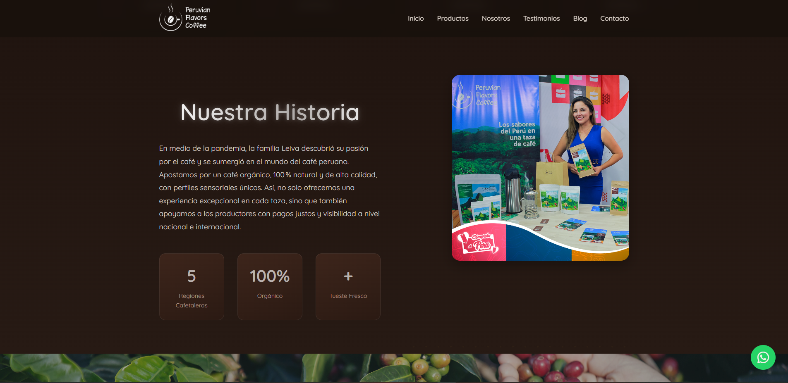

# ☕ Peruvian Flavors Coffee 🇵🇪
> **El sabor del café peruano, directo a tu taza**  
> Página web oficial de *Peruvian Flavors Coffee*, donde tradición y calidad se encuentran en cada grano.

---



---

## 📜 Descripción
**Peruvian Flavors Coffee** es una página web profesional desarrollada para transmitir la esencia del café peruano. El proyecto busca resaltar la historia, tradición y calidad de los granos, además de ofrecer un espacio digital moderno para la venta de productos artesanales.  

La web está optimizada para brindar una experiencia fluida, moderna y responsive, integrando herramientas que facilitan la compra y el contacto directo con la marca.

---

## ✨ Características principales
- 🎨 **Diseño moderno y responsive**, adaptable a dispositivos móviles y de escritorio  
- 📖 Sección de **Historia** con la trayectoria y orígenes de la marca  
- 📦 **Catálogo digital** con productos de alta calidad y fotografías profesionales  
- 📲 **Integración con WhatsApp** para pedidos y consultas directas  
- 🚀 **Código optimizado** para SEO y velocidad de carga  
- 🌐 **Dominio incluido** en la implementación  

---

## 🛠️ Tecnologías utilizadas

| Tecnología       | Uso principal |
|------------------|--------------|
|  | Estructura del sitio |
|    | Estilos y diseño |
|  | Interactividad |
|  | Framework del proyecto |
|  | Iconos |
|  | Control de versiones |

---

## 📦 Instalación y uso

Clona este repositorio e inicia el proyecto en tu entorno local:

```bash
git clone https://github.com/usuario/peruvian-flavors-coffee.git
cd peruvian-flavors-coffee
npm install
npm run dev

